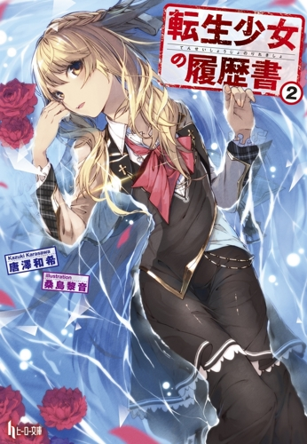

# Do It Yourself Translations

This is my first time translating anything from japanese. Think my translations suck? Learn Japanese and *Do It Yourself*.

The reason for doing this on github rather than some shitty wordpress blog is that translators always say something like "please comment when you see any mistakes" but never actually update anything. So, using github you can *Do It Yourself* and all I have to do is merge the changes.

Don't get the wrong idea, it's not like I'm lazy or anything! I'm just very busy so don't go expect frequent updates. Probably about once every month-ish. Though I'll try doing it faster once the summer holidays start. No promises!

## Résumé of a Reincarnated Girl

* JP title: 転生少女の履歴書 (tensei shoujo no rirekisho)
* Author: 唐澤和希/鳥好きのピスタチオ (Karasawa Kazuki/Bird-loving Pistachio)
* Raws: <http://ncode.syosetu.com/n4269cp>

for previous chapters visit [novelupdates](https://www.novelupdates.com/series/tensei-shoujo-no-rirekisho/)

### Chapters 

[Freshman Arc ⑯ Ice Magic Stones](./v02/freshman_arc_16.md)
